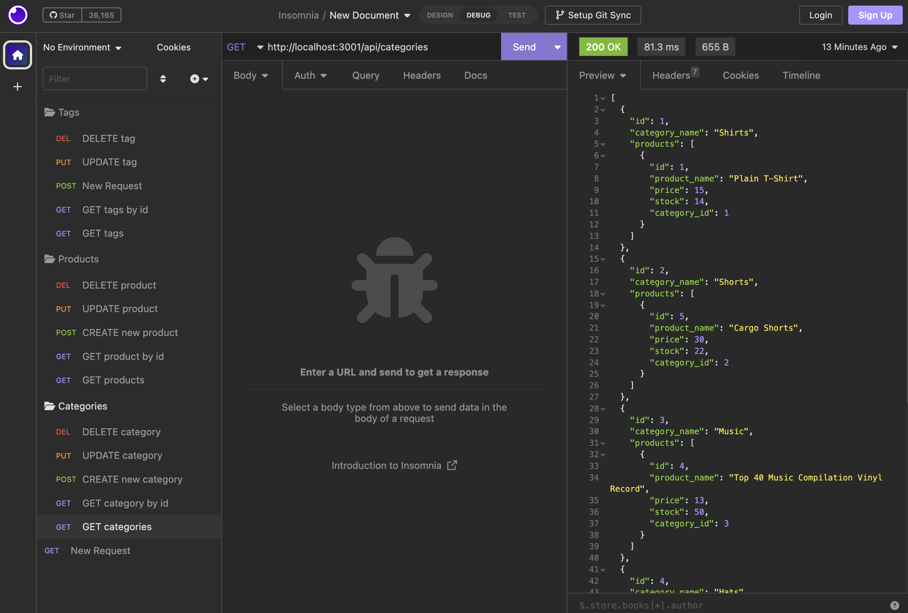

# E-commerce Database
 

## Description
This is a back end for an e-commerce site using Sequelize to interact with a MySQL database. Check out this [video](https://drive.google.com/file/d/1qi6dp7nd0x2Q0hXeTUTCzd-HTvnh_zfM/view) walkthrough to learn more about the application!

## Table of Contents
- [Installation](#installation)
- [Usage](#usage)
- [Credits](#credits)
- [License](#license)
- [Contributing](#contributing)
- [Tests](#tests)
- [Questions](#questions)

## Installation
To create the database, use the schema in the db folder with MySQL shell commands. Then seed the data by running npm run seed in the command line. Lastly start the server by running npm start in the command line.

## Usage
To explore the database, use a REST client such as Insomnia or Postman to view test and validate results.

## Credits
Collaborators: Amaryah Wolf 
Starter code provided by UCLA Coding Bootcamp

## License
This application is covered under the MIT license.

## Contributing
N/A

## Tests
N/A

## Questions
For additional questions, find me on [github](https://github.com/amaryahwolf) or email me at amaryahwolf@gmail.com.